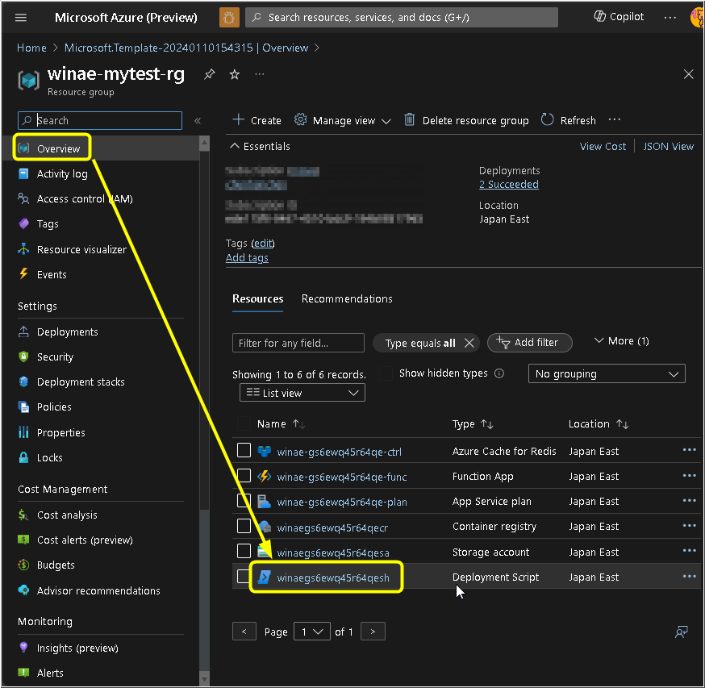
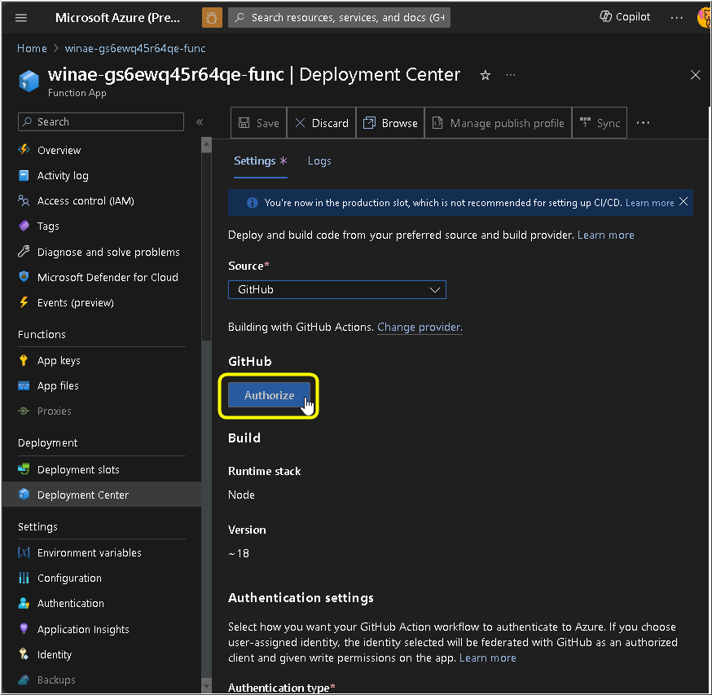
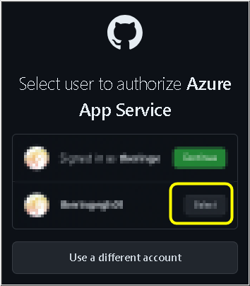
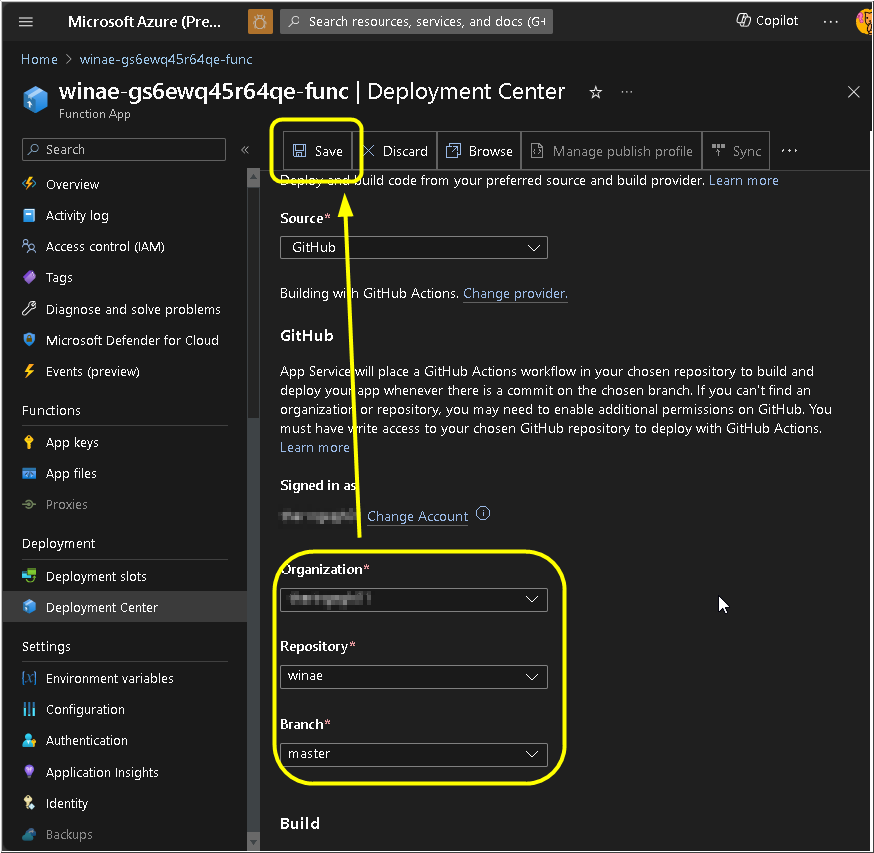
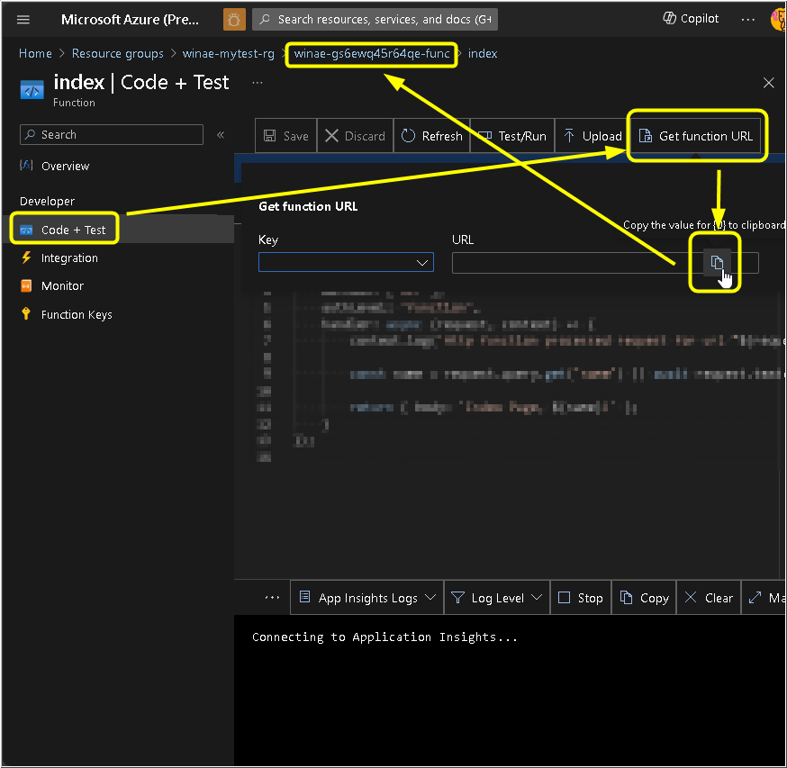
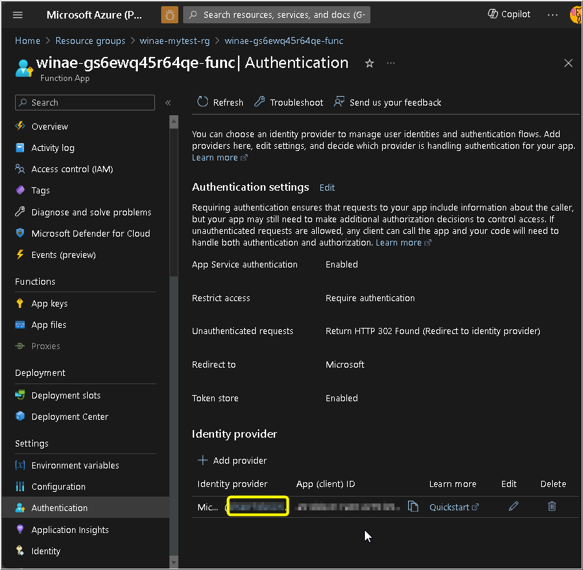
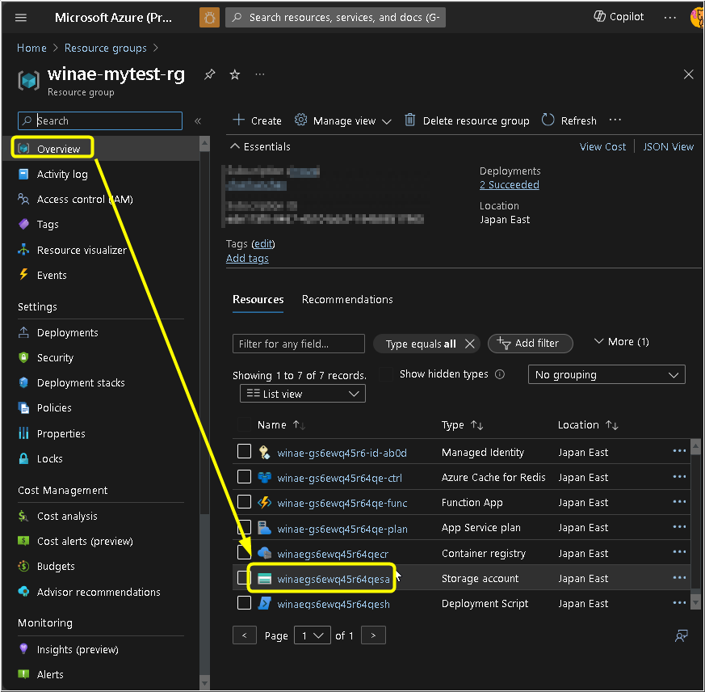
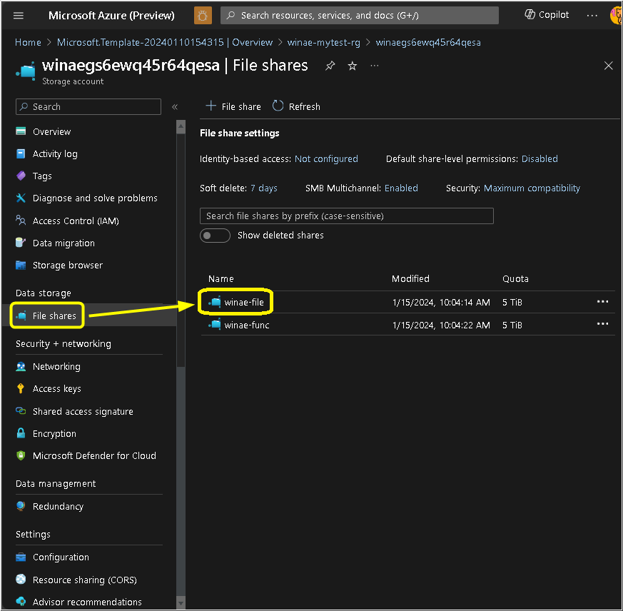
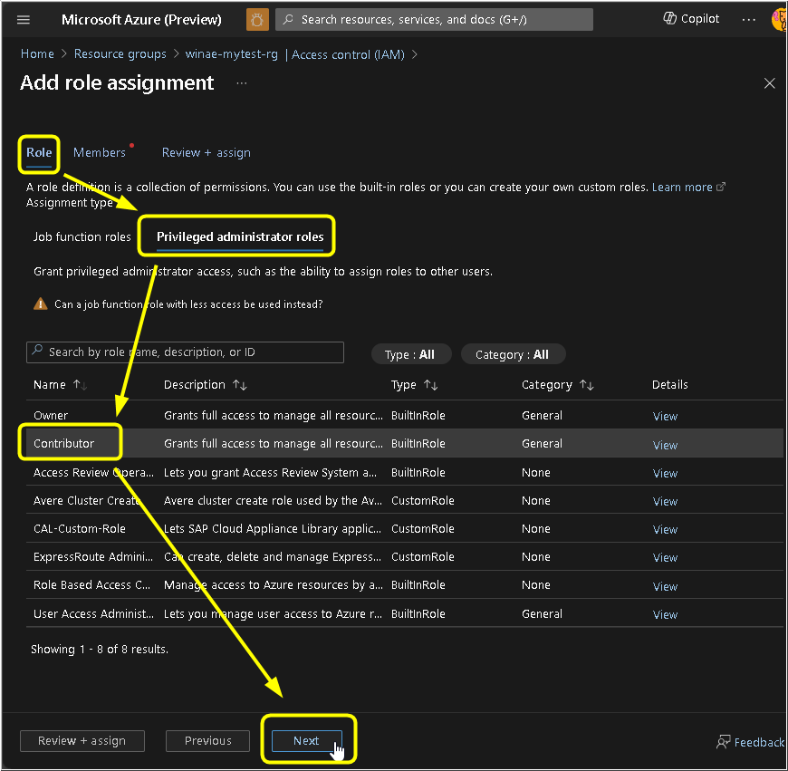

# WINAE: a Windows based containerized Adobe After Effects renderer

---

### Related Blog

[Cloud Rendering Adobe After Effects Video with Windows Docker Container](https://mohohan.com/393)

### Prerequisite

| Item                | Detail                                                                                                                                                   |
| --------------------- | ---------------------------------------------------------------------------------------------------------------------------------------------------------- |
| Host Machine / OS   | Hardware configuration requires at least a 4-core processor and 8GB of memory. The operating system must be Windows 10/11 and a 64-bit operating system. |
| Software            | [Installed Docker Desktop Windows](https://docs.docker.com/desktop/install/windows-install/)                                                             |
| Software (Optional) | Installed Adobe After Effects 2022 Must have a genuine license                                                                                           |
| Software            | [Adobe After Effects Installer Package](https://adminconsole.adobe.com) Must have a genuine license                                                      |
| Software (Optional) | Rowbyte Plexus Plugin Must have a genuine license                                                                                                        |
| Cloud Platform      | Azure account with a subscription ([Sign up](https://signup.azure.com/signup) if you don't have it)                                                      |
| Github              | Github account ([Sign up](https://github.com/signup) if you don't have it)                                                                               |

---

### Installation

| Step | Detail                                                                                                                                                                                                                                                                                                |
| ------ | ------------------------------------------------------------------------------------------------------------------------------------------------------------------------------------------------------------------------------------------------------------------------------------------------------- |
| 1    | [Fork this repo](https://github.com/theringe/winae/fork)                                                                                                                                                                                                                                              |
|      |                                                                                                                                                                                                                                                         |
|      |                                                                                                                                                                                                                                                         |
| 2    |                                                                                                     |
| 2-01 | Create a new "Resource Group" by specifying a name (e.g., winae-mytest-rg)                                                                                                                                                                                                                            |
|      |                                                                                                                                                                                                                                                         |
| 2-02 | Select a proper "Region" nearby your workplace, Keep "Resource Prefix" and "Encryption Key" as default value                                                                                                                                                                                          |
|      |                                                                                                                                                                                                                                                         |
| 2-03 | Click "Create"                                                                                                                                                                                                                                                                                        |
|      |                                                                                                                                                                                                                                                         |
| 2-04 | Wait for Azure around 10-20 minutes to allocate the related resources                                                                                                                                                                                                                                 |
|      |                                                                                                                                                                                                                                                         |
| 2-05 | Click "Go to resource group" once the deployment has been done                                                                                                                                                                                                                                        |
|      |                                                                                                                                                                                                                                                         |
| 2-06 | In the resource group, click the "Deployment Script" resource                                                                                                                                                                                                                                         |
|      |                                                                                                                                                                                                                                                         |
| 2-07 | In the "Overview" section from "Deployment Script" resource, copy all the information from "Logs" for further use (in How to use: 6-01), then close this resource and go back to resource group                                                                                                       |
|      |                                                                                                                                                                                                                                                         |
| 2-08 | Back to resource group, click the "Function App" resource                                                                                                                                                                                                                                             |
|      |                                                                                                                                                                                                                                                         |
| 2-09 | In the "Deployment Center" section from "Function App" resource, select "GitHub" as the source                                                                                                                                                                                                        |
|      |                                                                                                                                                                                                                                                         |
| 2-10 | Then click "Authorize"                                                                                                                                                                                                                                                                                |
|      |                                                                                                                                                                                                                                                         |
| 2-11 | You will be redirected to github.com and select your GitHub account to login                                                                                                                                                                                                                          |
|      |                                                                                                                                                                                                                                                         |
| 2-12 | Then authorize Azure App Service by click the button                                                                                                                                                                                                                                                  |
|      |                                                                                                                                                                                                                                                         |
| 2-13 | Back to Azure Portal, now your GitHub account has been associated with your Azure account, select your GitHub account as the "Organization", "winae" as the "Repository", and "master" as the "Branch". Then click "save"                                                                             |
|      |                                                                                                                                                                                                                                                         |
| 2-14 | You are now deploying the control panel of WINAE to Function App, wait for Azure around 5-10 minutes to publish the code on server, you can got to "Actions" in your forked Github repo to see the latest status, once finished, you can see some Functions in the "Overview" section, click "index"  |
|      |                                                                                                                                                                                                                                                         |
| 2-15 | In "Code + Test" section, click "Get function URL" and then copy the URL for further use (in 2-28), it is the URL of the WINAE control panel, finally go back to the "Function App" resource                                                                                                          |
|      |                                                                                                                                                                                                                                                         |
| 2-16 | Again in the "Function App" resource, go to "Authentication" section and click "Add identity provider"                                                                                                                                                                                                |
|      |                                                                                                                                                                                                                                                         |
| 2-17 | Select "Microsoft" as "Identity provider" and click "Add"                                                                                                                                                                                                                                             |
|      |                                                                                                                                                                                                                                                         |
| 2-18 | Wait for Azure around 1-2 minutes to issue the app registration, and click the target "identity provider" when ready                                                                                                                                                                                  |
|      |                                                                                                                                                                                                                                                         |
| 2-19 | This is the page of the new created "App registration". In "Overview" section, copy "Application ID" and "Tenant ID" for further use (in 2-20), then go back to "Function App" resource                                                                                                               |
|      |                                                                                                                                                                                                                                                         |
| 2-20 | Again in the "Function App" resource, go to "Environment variables" section, create 2 variables: set "MICROSOFT_PROVIDER_AUTHENTICATION_APPID" and "MICROSOFT_PROVIDER_AUTHENTICATION_TENANTID" as the related value you have copied from 2-21, then click "Apply" and go back to resource group page |
|      |                                                                                                                                                                                                                                                         |
| 2-21 | Again in the resource group, click the "Storage Account" resource                                                                                                                                                                                                                                     |
|      |                                                                                                                                                                                                                                                         |
| 2-22 | In the "Storage Account" resource, go to "File shares" section and click "winae-file"                                                                                                                                                                                                                 |
|      |                                                                                                                                                                                                                                                         |
| 2-23 | In "Overview" page, click "Connect", select "A" as "Drive Letter", click "Show Script", then copy the script for further use (in How to use: 5-01), finally close this page                                                                                                                           |
|      |                                                                                                                                                                                                                                                         |
| 2-24 | Go back to resource group page                                                                                                                                                                                                                                                                        |
|      |                                                                                                                                                                                                                                                         |
| 2-25 | Again in the resource group, click the "Access Control (IAM)" section, click "Role Assignments", click "Add" and select "Add role assignment"                                                                                                                                                         |
|      |                                                                                                                                                                                                                                                         |
| 2-26 | In role assignment page, click "Privileged administratior roles", select "Contributor", and click "Next"                                                                                                                                                                                              |
|      |                                                                                                                                                                                                                                                         |
| 2-27 | In this page, click "Select members", and search for "winae", choose the app registration which be created from 2-21, finally click "Next", "Select" and "Review + assign"                                                                                                                            |
|      |                                                                                                                                                                                                                                                         |
| 2-28 | Open a browser tab, paste the URL copied (from 2-15) and proceed with the installation guide on that page (Control Panel)                                                                                                                                                                             |
|      | [**Once all the installation steps on the control panel page have been completed, return to How To Use on this page to continue**]                                                                                                                                                                    |

### How To Use

| Step | Detail                                                                                                                                                                                                                                                                                                                                                                                                                                                                                                                                                                                                                                                                                                                                                                                                                                                                                                                                                                                                                                                                                                                                                                                                                                                                                    |
| ------ | ------------------------------------------------------------------------------------------------------------------------------------------------------------------------------------------------------------------------------------------------------------------------------------------------------------------------------------------------------------------------------------------------------------------------------------------------------------------------------------------------------------------------------------------------------------------------------------------------------------------------------------------------------------------------------------------------------------------------------------------------------------------------------------------------------------------------------------------------------------------------------------------------------------------------------------------------------------------------------------------------------------------------------------------------------------------------------------------------------------------------------------------------------------------------------------------------------------------------------------------------------------------------------------------- |
| 5    | Mount the network drive to your work computer. This only needs to be done once for each work computer. Project files and media assets can be directly stored on the network drive                                                                                                                                                                                                                                                                                                                                                                                                                                                                                                                                                                                                                                                                                                                                                                                                                                                                                                                                                                                                                                                                                                         |
| 5-01 | Start a PowerShell terminal and enter the command that you copied in installation step 2-23                                                                                                                                                                                                                                                                                                                                                                                                                                                                                                                                                                                                                                                                                                                                                                                                                                                                                                                                                                                                                                                                                                                                                                                               |
|      |                                                                                                                                                                                                                                                                                                                                                                                                                                                                                                                                                                                                                                                                                                                                                                                                                                                                                                                                                                                                                                                                                                                                                                                                                                             |
| 5-02 | After that, your computer will have an additional network drive                                                                                                                                                                                                                                                                                                                                                                                                                                                                                                                                                                                                                                                                                                                                                                                                                                                                                                                                                                                                                                                                                                                                                                                                                           |
|      |                                                                                                                                                                                                                                                                                                                                                                                                                                                                                                                                                                                                                                                                                                                                                                                                                                                                                                                                                                                                                                                                                                                                                                                                                                             |
| 5-03 | Here is a brief introduction to the folder structure on the network drive:<ul><li>"media/" is used to store project-related media assets. It is recommended to create different project-specific folders to organize media assets for different projects. Currently, there is an example project media folder named "sample-3m-azapp/", which will be used in the demonstration later.</li><li>"output/" is the folder for rendered video outputs. After each rendering task is completed, a video file with the project name will be generated in this folder.</li><li>"project/" is the project file folder, and it is a special location. Winae monitors the project files in this folder. If the project file name follows the format [projectName___compositionName___numberOfFrames], Winae will initiate the rendering process. Upon completion, the file will be renamed as [projectName___compositioName___DONE].</li><li>"temp/" stores temporary or intermediate files generated during the rendering tasks. You can also place project files that are not yet ready for rendering during the editing phase. Currently, there is an example file named "sample-3m-azapp___EP___4536".</li><li>"tool/" is a system program folder and should not be modified for now.</li></ul> |
|      |                                                                                                                                                                                                                                                                                                                                                                                                                                                                                                                                                                                                                                                                                                                                                                                                                                                                                                                                                                                                                                                                                                                                                                                                                                             |
| 5-04 | You can use your Adobe After Effects to edit this sample project. Next, we will initiate a rendering task                                                                                                                                                                                                                                                                                                                                                                                                                                                                                                                                                                                                                                                                                                                                                                                                                                                                                                                                                                                                                                                                                                                                                                                 |
|      |                                                                                                                                                                                                                                                                                                                                                                                                                                                                                                                                                                                                                                                                                                                                                                                                                                                                                                                                                                                                                                                                                                                                                                                                                                             |
| 6-01 | We now copy the project file from the "temp/" folder to the "project/" folder, then open a new browser tab and paste the previously copied URL (from step 2-15) to enter the control panel, next, in the startup script, please copy the content that we copied in installation step 2-07. Note that it has two paragraphs, please copy the content of the second paragraph, starting with "powershell.exe c:/users/containeradministrator/winae-wrapper.ps1 ....", Finally, click "Launch WINAE renderer nodes"                                                                                                                                                                                                                                                                                                                                                                                                                                                                                                                                                                                                                                                                                                                                                                          |
|      |                                                                                                                                                                                                                                                                                                                                                                                                                                                                                                                                                                                                                                                                                                                                                                                                                                                                                                                                                                                                                                                                                                                                                                                                                                             |
| 6-02 | After clicking the launch button, please wait for 20-40 seconds. Afterwards, the system will begin to start the renderer nodes, and the control panel status will change to "ONLINE". The original start button will be disabled (and renamed to "winae is starting...")                                                                                                                                                                                                                                                                                                                                                                                                                                                                                                                                                                                                                                                                                                                                                                                                                                                                                                                                                                                                                  |
|      |                                                                                                                                                                                                                                                                                                                                                                                                                                                                                                                                                                                                                                                                                                                                                                                                                                                                                                                                                                                                                                                                                                                                                                                                                                             |
| 6-03 | Azure takes some time to start the renderer nodes. Once started, it will immediately begin executing rendering tasks, and the control panel status will change to something like "rendering project(s): sample-3m-azapp"                                                                                                                                                                                                                                                                                                                                                                                                                                                                                                                                                                                                                                                                                                                                                                                                                                                                                                                                                                                                                                                                  |
|      |                                                                                                                                                                                                                                                                                                                                                                                                                                                                                                                                                                                                                                                                                                                                                                                                                                                                                                                                                                                                                                                                                                                                                                                                                                             |
| 6-04 | At this point, in your network drive's "project/" folder, in addition to the original project files, a temporary "Logs" folder will also be created (and removed after rendering completion)                                                                                                                                                                                                                                                                                                                                                                                                                                                                                                                                                                                                                                                                                                                                                                                                                                                                                                                                                                                                                                                                                              |
|      |                                                                                                                                                                                                                                                                                                                                                                                                                                                                                                                                                                                                                                                                                                                                                                                                                                                                                                                                                                                                                                                                                                                                                                                                                                             |
| 6-05 | Additionally, in the network drive's "temp/" folder, intermediate files produced during rendering will also be added (and removed after rendering completion). All of this indicates that the current task is in progress                                                                                                                                                                                                                                                                                                                                                                                                                                                                                                                                                                                                                                                                                                                                                                                                                                                                                                                                                                                                                                                                 |
|      |                                                                                                                                                                                                                                                                                                                                                                                                                                                                                                                                                                                                                                                                                                                                                                                                                                                                                                                                                                                                                                                                                                                                                                                                                                             |
| 6-06 | After the rendering is completed, the control panel status will change back to "ONLINE". After a certain period of time with no new tasks, all renderer nodes will be shut down (and the status will change to "OFFLINE")                                                                                                                                                                                                                                                                                                                                                                                                                                                                                                                                                                                                                                                                                                                                                                                                                                                                                                                                                                                                                                                                 |
|      |                                                                                                                                                                                                                                                                                                                                                                                                                                                                                                                                                                                                                                                                                                                                                                                                                                                                                                                                                                                                                                                                                                                                                                                                                                             |
| 6-07 | At this point, your "output/" folder will already contain the rendered video                                                                                                                                                                                                                                                                                                                                                                                                                                                                                                                                                                                                                                                                                                                                                                                                                                                                                                                                                                                                                                                                                                                                                                                                              |
|      |                                                                                                                                                                                                                                                                                                                                                                                                                                                                                                                                                                                                                                                                                                                                                                                                                                                                                                                                                                                                                                                                                                                                                                                                                                             |
